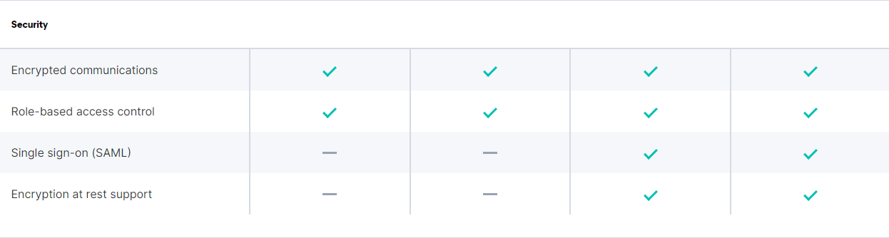

**Encrypting communications in an Elasticsearch Cluster**
in Production mode:\
Set `vm.max_map_count` to at least **262144**\
The `vm.max_map_count` kernel setting must be set to at least 262144 for **production** use

```
sysctl -w vm.max_map_count=262144
```

The `vm.max_map_count` setting should be set permanently in **/etc/sysctl.conf**:
```
grep vm.max_map_count /etc/sysctl.conf`
vm.max_map_count=262144
```

To apply the setting on a live system, run:
```
sysctl -w vm.max_map_count=262144
```

If change Directory mount point on docker-compose file must command under for specific directory 

For example /home/node1:/usr/share/elasticsearch/data

```
sudo chown -R 1000:1000 /home/node1
```


[Elastic Stack subscriptions](https://www.elastic.co/subscriptions)

create a `instances.yml`:
``` yaml
instances:
  - name: es01
    dns:
      - es01 
      - localhost
    ip:
      - 127.0.0.1
  - name: es02
    dns:
      - es02
      - localhost
    ip:
      - 127.0.0.1
  - name: es03
    dns:
      - es03 
      - localhost
    ip:
      - 127.0.0.1
  - name: es04
    dns:
      - es04
      - localhost
    ip:
      - 127.0.0.1
  - name: es05
    dns:
      - es05
      - localhost
    ip:
      - 127.0.0.1
```

create an `.env` file

```
COMPOSE_PROJECT_NAME=es 
CERTS_DIR=/usr/share/elasticsearch/config/certificates 
ELASTIC_PASSWORD=PleaseChangeMe
```

create `certs.yml` file:

``` yaml
version: '3.9'

services:
  create_certs:
    container_name: create_certs
    image: docker.elastic.co/elasticsearch/elasticsearch:7.15.2
    command: >
      bash -c '
        rm -f /certs/bundle.zip
        if [[ ! -f /certs/bundle.zip ]]; then
          bin/elasticsearch-certutil cert --silent --pem --in config/certificates/instances.yml -out /certs/bundle.zip;
          unzip /certs/bundle.zip -d /certs; 
        fi;
        chown -R 1000:0 /certs
      '
    user: "0"
    working_dir: /usr/share/elasticsearch
    volumes: ['certs:/certs', '.:/usr/share/elasticsearch/config/certificates']

volumes: {"certs"}
```

Generate the certificates (only needed once)

```
docker-compose -f certs.yml run --rm create_certs
```

at next step bring up all elastic nodes with `docker-compose.yaml`:

``` yaml
version: '3.9'
## Mobin-NET
services:
  es01:
    image: docker.mediana.ir/elasticsearch/elasticsearch:7.15.2
    container_name: es01
    restart: always
    environment:
      - node.name=es01
      - cluster.name=es-docker-cluster
      - discovery.seed_hosts=es01,es02,es03,es04,es05
      - cluster.initial_master_nodes=es01,es02,es03,es04,es05
      - network.publish_host=5.253.27.124
      - ELASTIC_PASSWORD=$ELASTIC_PASSWORD 
      - bootstrap.memory_lock=true
      - "ES_JAVA_OPTS=-Xms512m -Xmx512m"
      - xpack.security.enabled=true
      - xpack.license.self_generated.type=basic 
      - xpack.security.http.ssl.enabled=true
      - xpack.security.http.ssl.key=$CERTS_DIR/es01/es01.key
      - xpack.security.http.ssl.certificate_authorities=$CERTS_DIR/ca/ca.crt
      - xpack.security.http.ssl.certificate=$CERTS_DIR/es01/es01.crt
      - xpack.security.transport.ssl.enabled=true
      - xpack.security.transport.ssl.verification_mode=certificate 
      - xpack.security.transport.ssl.certificate_authorities=$CERTS_DIR/ca/ca.crt
      - xpack.security.transport.ssl.certificate=$CERTS_DIR/es01/es01.crt
      - xpack.security.transport.ssl.key=$CERTS_DIR/es01/es01.key
    volumes: 
      - data01:/usr/share/elasticsearch/data
      - $PWD/certs:/usr/share/elasticsearch/config/certificates
    ulimits:
      memlock:
        soft: -1
        hard: -1
    ports:      - 9200:9200
      - 9300:9300
    networks:
      - my_service
    healthcheck:
      test: curl --cacert $CERTS_DIR/ca/ca.crt -s https://localhost:9200 >/dev/null; if [[ $$? == 52 ]]; then echo 0; else echo 1; fi
      interval: 30s
      timeout: 10s
      retries: 5
    extra_hosts:
      # - "es01:YOUR_IP_es01"
      - "es02:YOUR_IP_es02"
      - "es03:YOUR_IP_es03"
      - "es04:YOUR_IP_es04"
      - "es05:YOUR_IP_es05"

volumes:
  data01:
networks:
  my_service:
    external: true
```

we set `basic` for license as below config:
```
xpack.license.self_generated.type=basic
```
if your nodes are in local network, extra_hosts should be like `192.168.x.x` and create needed rules in your firewal with NAT


Now you can Access the Elasticsearch API over SSL/TLS using the bootstrapped password:
```
curl --cacert certs/ca/ca.crt -u elastic:PleaseChangeMe https://localhost:9200
```

some useful urls

```
https://{{elasticsearch_url}}/_cat/nodes?v&pretty
https://{{elasticsearch_url}}/_cluster/health
https://{{elasticsearch_url}}/_cat/nodes?v=true&pretty
https://{{elasticsearch_url}}/_cat/shards?v=true&pretty
```
